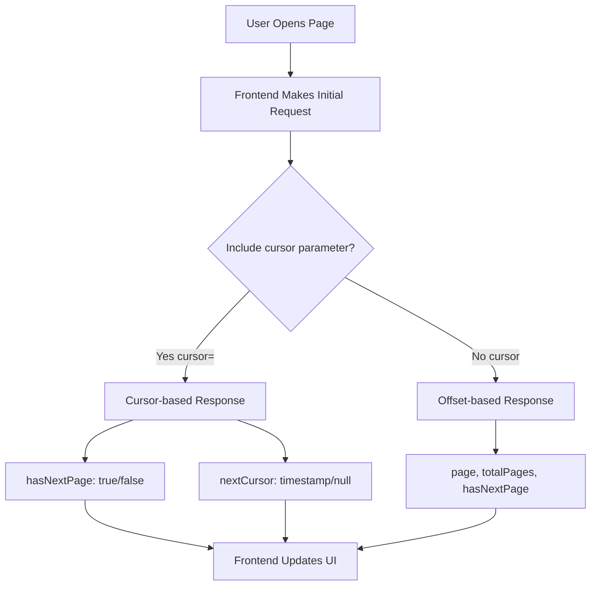
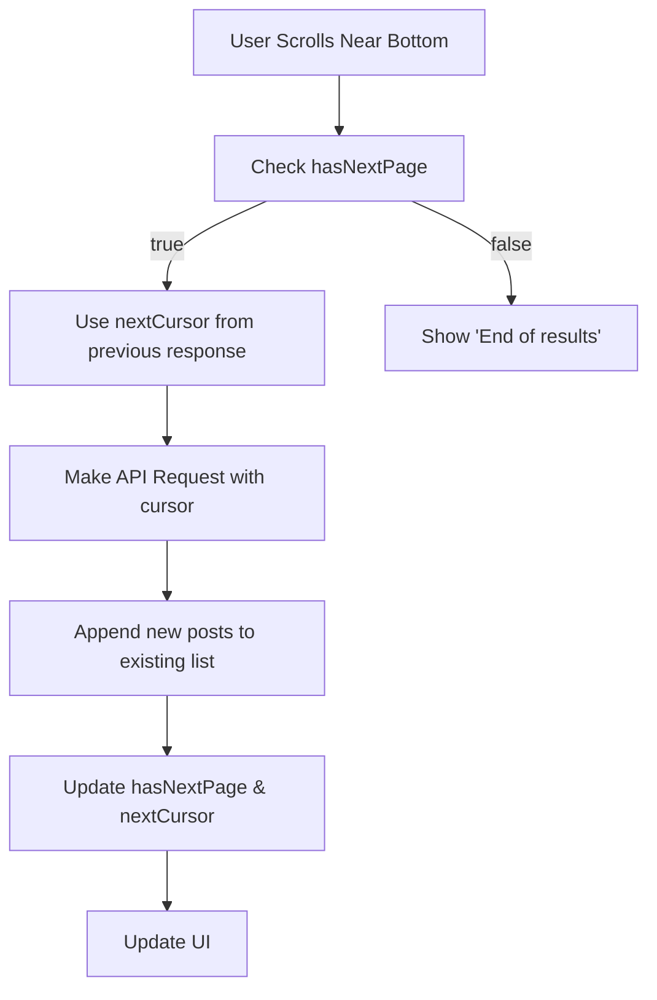
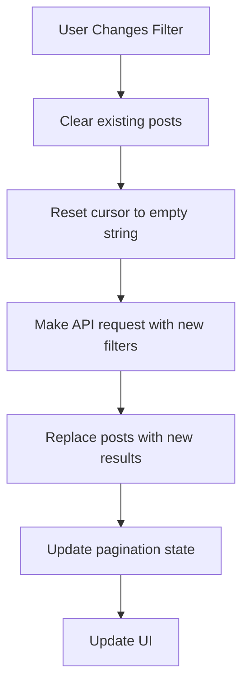

# Posts API - Complete Data Flow & Integration Guide

## 🚀 API Endpoint Overview

**Base URL**: `GET /api/discussions/posts`

## 📋 Request Flow Documentation

### 1. Pagination Mode Detection

The API automatically detects which pagination mode to use:

- **Cursor-based (Infinite Scroll)**: When `cursor` parameter is present (even if empty)
- **Offset-based (Traditional)**: When `cursor` parameter is absent

```typescript
// Frontend Request Examples
// Infinite Scroll Mode
GET /api/discussions/posts?limit=10&cursor=                              // First page
GET /api/discussions/posts?limit=10&cursor=2025-08-09T08:22:38.033Z     // Subsequent pages

// Traditional Pagination Mode  
GET /api/discussions/posts?limit=10&page=1                              // First page
GET /api/discussions/posts?limit=10&page=2                              // Second page
```

### 2. Complete Request Parameters

| Parameter | Type | Required | Default | Description | Example |
|-----------|------|----------|---------|-------------|---------|
| `limit` | number | No | 10 | Posts per page/request | `15` |
| `page` | number | No | 1 | Page number (offset mode only) | `2` |
| `cursor` | string | No | undefined | ISO timestamp (triggers infinite scroll) | `2025-08-09T08:22:38.033Z` |
| `search` | string | No | "" | Search in title/content | `"feed"` |
| `tag` | string | No | "" | Filter by tag name | `"Health"` |
| `sort` | string | No | "recent" | Sort order | `"popular"`, `"replies"` |
| `is_market_post` | boolean | No | undefined | Filter post type | `true`, `false` |
| `user_id` | number | No | undefined | Filter by author | `7` |
| `include_unapproved` | boolean | No | false | Include pending posts | `true` |

### 3. Request URL Examples

```bash
# Basic infinite scroll (first page)
GET /api/discussions/posts?limit=10&cursor=

# Infinite scroll with filters
GET /api/discussions/posts?limit=10&cursor=&tag=Health&search=vaccination

# Market posts only with infinite scroll
GET /api/discussions/posts?limit=10&cursor=&is_market_post=true

# User's posts with infinite scroll  
GET /api/discussions/posts?limit=10&cursor=&user_id=7

# Sort by popularity with infinite scroll
GET /api/discussions/posts?limit=10&cursor=&sort=popular

# Traditional pagination
GET /api/discussions/posts?limit=10&page=1
```

## 📤 Response Flow Documentation

### 1. Response Structure (Success)

```json
{
  "success": true,
  "data": {
    "posts": [...],
    "pagination": {...},
    "facets": {...}
  }
}
```

### 2. Post Object Structure

```typescript
interface Post {
  id: string;                                    // UUID
  title: string;                                 // Post title
  content: string;                               // Post content/description
  author: {
    id: number;                                  // Author user ID
    firstname: string;                           // Author first name
    lastname: string;                            // Author last name
    avatar: null;                                // Always null currently
    level_id: number;                            // Always 1 currently
    points: number;                              // Author's reputation points
    location: string;                            // Always empty currently
  };
  tags: Array<{
    id: string;                                  // Tag UUID
    name: string;                                // Tag name ("Health", "Feed", etc.)
    color: string;                               // Tag color ("red", "yellow", etc.)
  }>;
  upvotes: number;                               // Number of upvotes
  downvotes: number;                             // Number of downvotes
  userVote: "upvote" | "downvote" | null;       // Current user's vote (null if not authenticated)
  replies: number;                               // Number of replies (always 0 currently)
  shares: number;                                // Number of shares (always 0 currently)
  isMarketPost: boolean;                         // Is this a market/commercial post
  isAvailable: boolean;                          // Item availability (for market posts)
  createdAt: string;                            // Human-readable time ("1d ago", "2d ago")
  media: Array<{
    id: string;                                  // Media UUID
    media_type: "image" | "video";               // Media type
    url: string;                                 // Full Cloudinary URL
    thumbnail_url: string;                       // Cloudinary thumbnail URL
    original_filename: string;                   // Original file name
    file_size: number;                           // Always 0 currently
    display_order: number;                       // Display order (0-based)
  }>;
  images: Post["media"];                         // Filtered array of image media only
  video: Post["media"][0] | null;               // First video or null
  isModeratorApproved: boolean;                  // Moderation status
}
```

### 3. Pagination Object Structure

#### Cursor-based (Infinite Scroll)
```typescript
interface CursorPagination {
  hasNextPage: boolean;                          // Are there more posts to load?
  nextCursor: string | null;                     // ISO timestamp for next request
  count: number;                                 // Number of posts in current response
}
```

#### Offset-based (Traditional)
```typescript
interface OffsetPagination {
  page: number;                                  // Current page number
  limit: number;                                 // Posts per page
  total: number;                                 // Total number of posts
  totalPages: number;                            // Total number of pages
  hasNextPage: boolean;                          // Is there a next page?
}
```

### 4. Facets Object Structure

```typescript
interface Facets {
  totals: {
    all: number;                                 // Total posts count (ignoring tag filter)
  };
  tags: Array<{
    id: string;                                  // Tag UUID
    name: string;                                // Tag name
    color: string;                               // Tag color
    count: number;                               // Number of posts with this tag
  }>;
}
```

### 5. Real Response Examples

#### First Page (Infinite Scroll)
```json
{
  "success": true,
  "data": {
    "posts": [
      {
        "id": "85e62b6f-ec5c-4b07-9297-dd32d194ef39",
        "title": "Disease Prevention Tips for Young Pigs",
        "content": "What are the most effective vaccination schedules...",
        "author": {
          "id": 7,
          "firstname": "Sarah",
          "lastname": "Expert",
          "avatar": null,
          "level_id": 1,
          "points": 890,
          "location": ""
        },
        "tags": [
          {
            "id": "550e8400-e29b-41d4-a716-446655440003",
            "name": "Health",
            "color": "red"
          },
          {
            "id": "550e8400-e29b-41d4-a716-446655440001",
            "name": "General", 
            "color": "blue"
          }
        ],
        "upvotes": 45,
        "downvotes": 1,
        "userVote": null,
        "replies": 0,
        "shares": 0,
        "isMarketPost": false,
        "isAvailable": true,
        "createdAt": "1d ago",
        "media": [
          {
            "id": "2519f0a6-9453-4a9a-a25a-37e55862cdf4",
            "media_type": "video",
            "url": "https://res.cloudinary.com/dsw1y9bmj/video/upload/v1754830408/farmconnect/posts/85e62b6f-ec5c-4b07-9297-dd32d194ef39/1754830371764_post_video.mp4",
            "thumbnail_url": "https://res.cloudinary.com/dsw1y9bmj/video/upload/c_fill,h_200,so_auto,w_300/v1/farmconnect/posts/85e62b6f-ec5c-4b07-9297-dd32d194ef39/1754830371764_post_video.jpg?_a=BAMAK+cc0",
            "original_filename": "post_video.mp4",
            "file_size": 0,
            "display_order": 0
          }
        ],
        "images": [],
        "video": {
          "id": "2519f0a6-9453-4a9a-a25a-37e55862cdf4",
          "media_type": "video",
          "url": "https://res.cloudinary.com/dsw1y9bmj/video/upload/v1754830408/farmconnect/posts/85e62b6f-ec5c-4b07-9297-dd32d194ef39/1754830371764_post_video.mp4",
          "thumbnail_url": "https://res.cloudinary.com/dsw1y9bmj/video/upload/c_fill,h_200,so_auto,w_300/v1/farmconnect/posts/85e62b6f-ec5c-4b07-9297-dd32d194ef39/1754830371764_post_video.jpg?_a=BAMAK+cc0",
          "original_filename": "post_video.mp4",
          "file_size": 0,
          "display_order": 0
        },
        "isModeratorApproved": true
      }
    ],
    "pagination": {
      "hasNextPage": true,
      "nextCursor": "2025-08-09T08:22:38.033Z",
      "count": 2
    },
    "facets": {
      "totals": { "all": 22 },
      "tags": [
        { "id": "550e8400-e29b-41d4-a716-446655440006", "name": "Breeding", "color": "pink", "count": 3 },
        { "id": "550e8400-e29b-41d4-a716-446655440005", "name": "Equipment", "color": "purple", "count": 4 },
        { "id": "550e8400-e29b-41d4-a716-446655440007", "name": "Events", "color": "orange", "count": 1 },
        { "id": "550e8400-e29b-41d4-a716-446655440004", "name": "Feed", "color": "yellow", "count": 5 },
        { "id": "550e8400-e29b-41d4-a716-446655440001", "name": "General", "color": "blue", "count": 9 },
        { "id": "550e8400-e29b-41d4-a716-446655440003", "name": "Health", "color": "red", "count": 7 },
        { "id": "550e8400-e29b-41d4-a716-446655440002", "name": "Market", "color": "green", "count": 9 }
      ]
    }
  }
}
```

## 🔄 Frontend Integration Flow

### 1. Initial Request Flow



### 2. Infinite Scroll Load More Flow



### 3. Filter Change Flow



## 🎯 RTK Query Integration Pattern

### 1. Complete API Service

```typescript
import { createApi, fetchBaseQuery } from '@reduxjs/toolkit/query/react';

export const postsApi = createApi({
  reducerPath: 'postsApi',
  baseQuery: fetchBaseQuery({
    baseUrl: '/api/discussions',
    prepareHeaders: (headers, { getState }) => {
      const token = (getState() as any).auth?.token;
      if (token) {
        headers.set('authorization', `Bearer ${token}`);
      }
      return headers;
    },
  }),
  tagTypes: ['PostsList'],
  endpoints: (builder) => ({
    getPostsInfinite: builder.query<PostsResponse, PostsFilters & { cursor?: string }>({
      query: (params) => ({
        url: '/posts',
        params: {
          limit: 10,
          ...params,
          cursor: params.cursor !== undefined ? params.cursor : '', // Critical for infinite scroll
        },
      }),
      providesTags: ['PostsList'],
    }),
  }),
});
```

### 2. Infinite Scroll Hook Pattern

```typescript
export const useInfiniteScrollPosts = (filters: PostsFilters = {}) => {
  const [allPosts, setAllPosts] = useState<Post[]>([]);
  const [nextCursor, setNextCursor] = useState<string>('');
  const [hasMore, setHasMore] = useState(true);

  const { data, isLoading, isFetching, error } = useGetPostsInfiniteQuery({
    ...filters,
    cursor: nextCursor,
  });

  useEffect(() => {
    if (!data) return;

    const { posts, pagination } = data;

    if (nextCursor === '') {
      // First page - replace posts
      setAllPosts(posts);
    } else {
      // Subsequent pages - append posts
      setAllPosts(prev => [...prev, ...posts]);
    }

    setHasMore(pagination.hasNextPage || false);
    setNextCursor(pagination.nextCursor || '');
  }, [data, nextCursor]);

  const loadMore = useCallback(() => {
    if (hasMore && !isFetching && data?.pagination.nextCursor) {
      setNextCursor(data.pagination.nextCursor);
    }
  }, [hasMore, isFetching, data?.pagination.nextCursor]);

  const resetPosts = useCallback(() => {
    setAllPosts([]);
    setNextCursor('');
    setHasMore(true);
  }, []);

  return {
    posts: allPosts,
    loadMore,
    resetPosts,
    hasMore,
    isLoading: isLoading && nextCursor === '',
    isFetching,
    error,
    facets: data?.facets,
  };
};
```

## ⚠️ Critical Implementation Notes

### 1. Cursor Parameter Requirement
**MUST INCLUDE**: The `cursor` parameter must be present in the query string to trigger infinite scroll mode:
- First page: `cursor=` (empty string)
- Subsequent pages: `cursor=2025-08-09T08:22:38.033Z`

### 2. Filter Changes Reset Pagination
When any filter changes, you must:
1. Clear existing posts array
2. Reset cursor to empty string
3. Make fresh API request

### 3. Media URL Structure
All media URLs are direct Cloudinary URLs - no need for proxy endpoints:
- Images: Full resolution and thumbnail URLs provided
- Videos: MP4 URLs with auto-generated thumbnail JPEGs

### 4. Tag Filtering Behavior
- When filtering by tag, posts are filtered on the backend
- Facet counts reflect current search/market/user filters but ignore tag selection
- This allows tag chips to show potential post counts for each tag

### 5. Error Handling
```typescript
if (error) {
  if ('status' in error) {
    // Handle HTTP errors
    console.error('API Error:', error.status, error.data);
  } else {
    // Handle network errors
    console.error('Network Error:', error.message);
  }
}
```

## 🚀 Quick Start Implementation

```typescript
// 1. Use the infinite scroll hook
const {
  posts,
  loadMore,
  hasMore,
  isLoading,
  isFetching,
  facets,
} = useInfiniteScrollPosts({
  sort: 'recent',
  limit: 10,
});

// 2. Render posts with infinite scroll
<InfiniteScrollContainer
  hasMore={hasMore}
  loadMore={loadMore}
  isLoading={isFetching}
>
  {posts.map(post => (
    <PostCard key={post.id} post={post} />
  ))}
</InfiniteScrollContainer>

// 3. Handle filters
const handleTagFilter = (tag: string) => {
  resetPosts(); // Clear existing posts
  updateFilters({ tag }); // This will trigger new API call
};
```

This documentation provides everything needed for smooth frontend integration with the Posts API's infinite scroll functionality.
