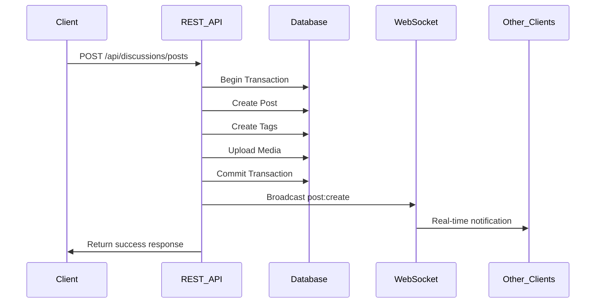

# Farm Connect Hybrid REST + WebSocket Architecture

## Overview

Farm Connect implements a sophisticated **hybrid REST + WebSocket architecture** for real-time social media functionality. This design provides the best of both worlds:

- **REST API**: Reliable, stateless operations for data persistence and complex queries
- **WebSocket**: Real-time bidirectional communication for instant updates and social features

## Current Implementation Status

### ✅ What's Already Implemented

1. **Complete WebSocket Service** (`src/services/webSocketService.ts`)

   - Socket.IO server with authentication middleware
   - Event-driven architecture with TypeScript interfaces
   - User connection tracking and presence management
   - Broadcasting capabilities for posts, replies, votes, and notifications

2. **REST + WebSocket Integration** in `createPost` endpoint

   - Post creation via REST API with transaction support
   - Automatic WebSocket broadcast after successful creation
   - Error handling that prevents WebSocket failures from breaking the API

3. **Authentication System**
   - Cookie-based authentication for web clients
   - JWT token authentication for WebSocket connections
   - Consistent user identity across REST and WebSocket

### ⚠️ Missing Integration

The WebSocket service is implemented but **not initialized** in the main application. The server needs to be updated to integrate WebSocket with the HTTP server.

## Architecture Flow

### Current CreatePost Flow



## WebSocket Events Architecture

### Post-Related Events

```typescript
// Outbound events (server → clients)
"post:create"; // New post created
"post:update"; // Post edited
"post:delete"; // Post deleted
"post:vote"; // Post voted on

// Reply-Related Events
"reply:create"; // New reply added
"reply:update"; // Reply edited
"reply:delete"; // Reply deleted
"reply:vote"; // Reply voted on

// User Activity Events
"user:online"; // User comes online
"user:offline"; // User goes offline
"user:typing"; // User typing in discussion

// Notification Events
"notification:new"; // New notification
"notification:read"; // Notification marked as read
```

### Room-Based Broadcasting

```typescript
// Global broadcasts (all connected users)
io.emit("post:create", postData);

// Room-specific broadcasts (users in specific discussion)
io.to(`post:${postId}`).emit("reply:create", replyData);

// User-specific broadcasts (private notifications)
io.to(socketId).emit("notification:new", notification);
```

## Implementation Guide

### 1. Initialize WebSocket in Main Application

Update `src/app.ts` to integrate WebSocket:

```typescript
import { createServer } from "http";
import { initializeWebSocket } from "./services/webSocketService";

class App {
  public app: Application;
  private server: any;
  private port: string | number;

  constructor() {
    this.app = express();
    this.port = process.env.PORT || 3000;

    this.initializeDatabase();
    this.initializeMiddlewares();
    this.initializeRoutes();
    this.initializeErrorHandling();
    this.initializeWebSocket(); // Add this
  }

  private initializeWebSocket(): void {
    // Create HTTP server
    this.server = createServer(this.app);

    // Initialize WebSocket service
    initializeWebSocket(this.server);
    console.log("🌐 WebSocket service initialized");
  }

  public listen(): void {
    // Use server.listen instead of app.listen
    this.server.listen(this.port, () => {
      console.log(`🚀 Farm Connect Backend running on port ${this.port}`);
      console.log(`📡 WebSocket server ready for connections`);
    });
  }
}
```

### 2. Client-Side WebSocket Integration

```typescript
// React WebSocket Hook
import { useEffect, useRef, useState } from "react";
import { io, Socket } from "socket.io-client";

export const useWebSocket = (token: string) => {
  const socketRef = useRef<Socket | null>(null);
  const [isConnected, setIsConnected] = useState(false);

  useEffect(() => {
    if (token) {
      // Initialize socket connection
      socketRef.current = io(process.env.REACT_APP_WEBSOCKET_URL, {
        auth: { token },
        transports: ["websocket", "polling"],
      });

      // Connection events
      socketRef.current.on("connect", () => {
        console.log("✅ Connected to WebSocket server");
        setIsConnected(true);
      });

      socketRef.current.on("disconnect", () => {
        console.log("❌ Disconnected from WebSocket server");
        setIsConnected(false);
      });

      // Real-time post events
      socketRef.current.on("post:create", (data) => {
        console.log("📝 New post created:", data);
        // Update UI state
      });

      socketRef.current.on("post:vote", (data) => {
        console.log("👍 Post voted:", data);
        // Update vote counts in UI
      });

      return () => {
        socketRef.current?.disconnect();
      };
    }
  }, [token]);

  // Helper functions
  const joinDiscussion = (postId: string) => {
    socketRef.current?.emit("discussion:join", { postId });
  };

  const leaveDiscussion = (postId: string) => {
    socketRef.current?.emit("discussion:leave", { postId });
  };

  const startTyping = (postId: string) => {
    socketRef.current?.emit("typing:start", { postId });
  };

  const stopTyping = (postId: string) => {
    socketRef.current?.emit("typing:stop", { postId });
  };

  return {
    socket: socketRef.current,
    isConnected,
    joinDiscussion,
    leaveDiscussion,
    startTyping,
    stopTyping,
  };
};
```

### 3. Real-time Posts Feed Component

```typescript
// components/RealTimePostsFeed.tsx
import React, { useEffect, useState } from "react";
import { useWebSocket } from "../hooks/useWebSocket";
import { useGetPostsQuery } from "../api/postsApi";

export const RealTimePostsFeed: React.FC = () => {
  const { socket, isConnected } = useWebSocket(authToken);
  const [posts, setPosts] = useState<Post[]>([]);
  const { data: initialPosts } = useGetPostsQuery({ limit: 20 });

  // Initialize posts from REST API
  useEffect(() => {
    if (initialPosts?.success) {
      setPosts(initialPosts.data.posts);
    }
  }, [initialPosts]);

  // Listen for real-time post events
  useEffect(() => {
    if (socket) {
      // New post created
      socket.on("post:create", (newPost) => {
        setPosts((prevPosts) => [newPost, ...prevPosts]);

        // Show notification
        showNotification("New post available!", newPost.title);
      });

      // Post voted
      socket.on("post:vote", (voteData) => {
        setPosts((prevPosts) =>
          prevPosts.map((post) =>
            post.id === voteData.postId
              ? {
                  ...post,
                  upvotes: voteData.upvotes,
                  downvotes: voteData.downvotes,
                }
              : post
          )
        );
      });

      // Post updated
      socket.on("post:update", (updatedPost) => {
        setPosts((prevPosts) =>
          prevPosts.map((post) =>
            post.id === updatedPost.id ? { ...post, ...updatedPost } : post
          )
        );
      });

      // Post deleted
      socket.on("post:delete", ({ postId }) => {
        setPosts((prevPosts) => prevPosts.filter((post) => post.id !== postId));
      });
    }
  }, [socket]);

  return (
    <div className="real-time-posts-feed">
      <div className="connection-status">
        {isConnected ? (
          <span className="online">🟢 Live updates active</span>
        ) : (
          <span className="offline">🔴 Connecting...</span>
        )}
      </div>

      {posts.map((post) => (
        <PostCard key={post.id} post={post} />
      ))}
    </div>
  );
};
```

### 4. Real-time Discussion Component

```typescript
// components/RealTimeDiscussion.tsx
import React, { useEffect, useState } from "react";
import { useWebSocket } from "../hooks/useWebSocket";

interface Props {
  postId: string;
}

export const RealTimeDiscussion: React.FC<Props> = ({ postId }) => {
  const { socket, joinDiscussion, leaveDiscussion, startTyping, stopTyping } =
    useWebSocket(authToken);
  const [replies, setReplies] = useState<Reply[]>([]);
  const [typingUsers, setTypingUsers] = useState<number[]>([]);
  const [isTyping, setIsTyping] = useState(false);

  // Join discussion room on mount
  useEffect(() => {
    joinDiscussion(postId);
    return () => leaveDiscussion(postId);
  }, [postId]);

  // Listen for real-time events
  useEffect(() => {
    if (socket) {
      // New reply
      socket.on("reply:create", (newReply) => {
        if (newReply.postId === postId) {
          setReplies((prev) => [...prev, newReply]);
        }
      });

      // Reply vote
      socket.on("reply:vote", (voteData) => {
        if (voteData.postId === postId) {
          setReplies((prev) =>
            prev.map((reply) =>
              reply.id === voteData.replyId
                ? {
                    ...reply,
                    upvotes: voteData.upvotes,
                    downvotes: voteData.downvotes,
                  }
                : reply
            )
          );
        }
      });

      // Typing indicators
      socket.on("user:typing", ({ userId, postId: eventPostId, isTyping }) => {
        if (eventPostId === postId) {
          setTypingUsers((prev) =>
            isTyping
              ? [...prev.filter((id) => id !== userId), userId]
              : prev.filter((id) => id !== userId)
          );
        }
      });
    }
  }, [socket, postId]);

  // Handle typing indicators
  const handleInputChange = (value: string) => {
    if (!isTyping && value.length > 0) {
      setIsTyping(true);
      startTyping(postId);
    } else if (isTyping && value.length === 0) {
      setIsTyping(false);
      stopTyping(postId);
    }
  };

  return (
    <div className="real-time-discussion">
      {/* Replies list */}
      {replies.map((reply) => (
        <ReplyCard key={reply.id} reply={reply} />
      ))}

      {/* Typing indicators */}
      {typingUsers.length > 0 && (
        <div className="typing-indicators">
          {typingUsers.length} user(s) typing...
        </div>
      )}

      {/* Reply input */}
      <ReplyInput
        onInputChange={handleInputChange}
        onSubmit={() => {
          setIsTyping(false);
          stopTyping(postId);
        }}
      />
    </div>
  );
};
```

## Security Considerations

### 1. Authentication

- WebSocket connections require valid JWT tokens
- Cookie-based authentication for web clients
- Token validation on every WebSocket connection

### 2. Authorization

- Room-based access control (users can only join discussions they have access to)
- Rate limiting on WebSocket events
- Input validation for all WebSocket events

### 3. Data Privacy

- User presence information (online/offline) respects privacy settings
- Private notifications only sent to intended recipients
- Room isolation prevents cross-discussion data leaks

## Performance Optimizations

### 1. Connection Management

- Automatic reconnection with exponential backoff
- Connection pooling for multiple browser tabs
- Graceful degradation when WebSocket unavailable

### 2. Event Throttling

- Typing indicators throttled to prevent spam
- Vote updates batched for better performance
- Large broadcasts split into smaller chunks

### 3. Caching Strategy

- Redis for WebSocket session storage (recommended for production)
- In-memory fallback for development
- Persistent user connection tracking

## Testing Strategy

### 1. Unit Tests

```typescript
// Test WebSocket service methods
describe("WebSocketService", () => {
  test("should broadcast post creation", () => {
    const mockPost = { id: "123", title: "Test Post" };
    webSocketService.broadcastPostCreate(mockPost);
    expect(mockIo.emit).toHaveBeenCalledWith("post:create", mockPost);
  });
});
```

### 2. Integration Tests

```typescript
// Test REST + WebSocket flow
describe("POST /api/discussions/posts", () => {
  test("should create post and broadcast to WebSocket", async () => {
    const response = await request(app)
      .post("/api/discussions/posts")
      .send(postData);

    expect(response.status).toBe(201);
    expect(mockWebSocket.broadcastPostCreate).toHaveBeenCalled();
  });
});
```

### 3. Load Testing

- Test concurrent WebSocket connections
- Measure broadcast latency under load
- Validate memory usage with large user counts

## Deployment Considerations

### 1. Production Setup

- Use Redis adapter for horizontal scaling
- Configure proper CORS settings
- Set up WebSocket load balancing

### 2. Monitoring

- Track WebSocket connection counts
- Monitor broadcast latency
- Alert on connection failures

### 3. Fallback Strategy

- Progressive enhancement (works without WebSocket)
- Polling fallback for unsupported browsers
- Graceful error handling

## Next Steps

1. **Initialize WebSocket** in main application
2. **Test authentication flow** between REST and WebSocket
3. **Implement client-side hooks** for real-time features
4. **Add comprehensive error handling**
5. **Set up monitoring and analytics**
6. **Performance testing** with concurrent users

This hybrid architecture provides a robust foundation for real-time social media features while maintaining the reliability and simplicity of REST APIs for core functionality.
